# Content pipeline: three AI agents and a validator

Every question in this app is original, and each one comes with a structured Arabic explanation.
The questions are produced by **three specialised AI agents** with separate responsibilities,
plus an automated validator. No agent reviews its own work.

The agents are real, version-controlled [Claude Code subagents](https://docs.claude.com/en/docs/claude-code/sub-agents)
in [`.claude/agents/`](../.claude/agents). Each file is the agent's full system prompt, its allowed
tools and its rules. Anyone who opens this repository in Claude Code gets the same three agents.

```mermaid
flowchart LR
    R([Request<br/>e.g. 6 hard reading sets]) --> G
    G[amiram-question-generator<br/>writes drafts/*.json] --> V1{{validate_content.py}}
    V1 --> C1[amiram-quality-checker<br/>read-only audit]
    C1 -->|fixes applied| T[amiram-arabic-tutor<br/>adds explanations]
    T --> V2{{validate_content.py<br/>--require-explain}}
    V2 --> C2[amiram-quality-checker<br/>audits explanations]
    C2 -->|fixes applied| M[merge into data/]
    M --> B[python update.py<br/>build + package]
```



## The agents

| Agent | Role | Tools | Writes to |
|---|---|---|---|
| [`amiram-question-generator`](../.claude/agents/amiram-question-generator.md) | Writes original restatement, reading and sentence-completion items at easy / medium / hard levels, in the repo's JSON format | Read, Grep, Glob, Write, Bash | `drafts/` only |
| [`amiram-quality-checker`](../.claude/agents/amiram-quality-checker.md) | Independent auditor: one defensible answer, correct key, line references, level fit, giveaways, Arabic accuracy, originality | Read, Grep, Glob, Bash | **nothing**, reports only |
| [`amiram-arabic-tutor`](../.claude/agents/amiram-arabic-tutor.md) | Writes the explanation students see after answering: translation, why the key is right, why each other option is wrong, key vocabulary | Read, Grep, Glob, Write, Bash | `drafts/` or a separate explanation file |

Some rules are built into the tool permissions, so they don't depend on the prompt:

- The checker **cannot** edit files.
- The writers are told never to change `data/` or `src/`.
- The tutor must never change a question's options or answer key. If a key looks wrong, it reports the problem instead.

The main Claude Code session acts as the orchestrator. It runs the agents, applies the checker's
fixes, merges drafts into `data/`, rebuilds, and publishes. The project owner decides what gets published.

## The validator

[`tools/validate_content.py`](../tools/validate_content.py) uses only the Python standard library. It runs
on `data/practice.json`, `data/exams_generated.json` or any drafts file.

**Errors (exit code 1):**

- a question doesn't have exactly 4 distinct options
- the answer key is out of range
- a sentence completion has no `____` blank
- a reading item has no passage
- a line reference points outside its passage
- ✓ is missing from the correct option or marks another one
- an explanation part is missing
- an id is duplicated
- a practice question reuses an exam question

**Warnings (for the checker to judge):**

- the correct option is noticeably the longest
- answer letters are skewed, or the same letter is correct three times in a row
- an explanation names an option letter
- the Arabic uses "كلما … كلما"
- an exam's layout differs from the official 6 sections / 23 questions

```bash
python tools/validate_content.py                       # everything in data/
python tools/validate_content.py --require-explain drafts/new-sets.json
```

## Using the agents

Open the project in Claude Code and ask in plain language. For example:

- *"Use the amiram-question-generator agent to write 4 hard sentence-completion sets."*
- *"Run the amiram-quality-checker on data/practice.json."*
- *"Have the amiram-arabic-tutor explain the questions in drafts/rc-hard.json."*

## What the process has caught so far

Real findings from independent checks on this repository's content. These are the reason the rules
in the agent prompts exist.

| Finding | Where | Fix |
|---|---|---|
| A correct restatement said more than the original ("was offered the job" → "got the job") | practice, restatement | Key rewritten; a distractor made into a real contradiction |
| B was the key 13 of 30 times; A was never correct at hard level | practice, restatement | Positions rebalanced |
| The correct option was the longest in 16 of 30 reading items | practice, reading | Options trimmed or lengthened |
| One reading line echoed a widely quoted published example | practice, reading | Line rewritten |
| In many sentence completions the key was the only positive or negative word ("odd one out") | practice, sentence completion | Distractors replaced so one shares the key's direction |
| **A was correct in 53 of 58 exam sentence completions**, and D was never correct in restatement | mock exams | Options swapped with their explanations; exam ids versioned so old attempts aren't misread |
| Arabic explanations used "كلما … كلما" and named option letters | explanations | Rewritten; both now flagged by the validator |

None of the audits found a wrong answer key. Every problem found made questions guessable,
ambiguous or less accurate, and those are hard to spot when you review your own work.
